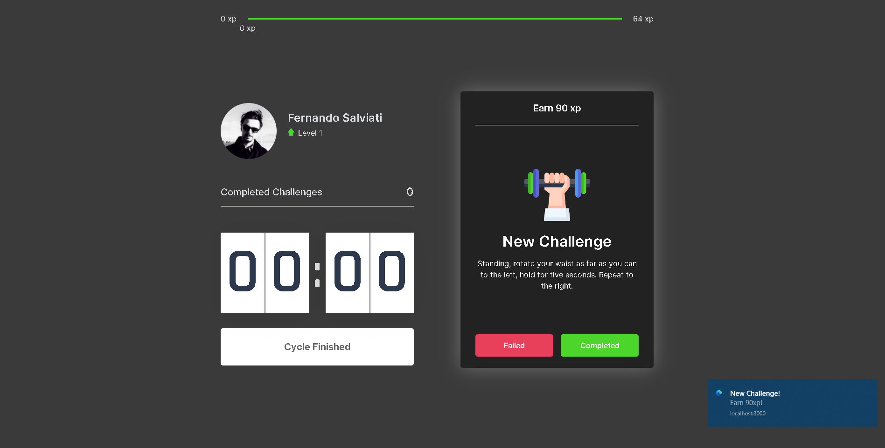

## React MoveIt APP
* Application developed using React.JS. The application displays alerts and audio in the browser every 25 minutes alerting the user to perform various exercises for the eyes and body, such as stretching and specific eye movements for relief, useful for people who work in front of the computer and often forget these small cares with our body.
* For each completed exercise, the user gains a certain number of experience points and can level up.

## Available Scripts
In the project directory, it is possible to run:

### `yarn start`
Runs the app in the development mode.\
Open [http://localhost:3000](http://localhost:3000) to view it in the browser.

The page will reload if you make edits.\
You will also see any lint errors in the console.

## Screenshot

## Application developed using the following:
* React.JS
* Typescript
* Next.JS
* Context
